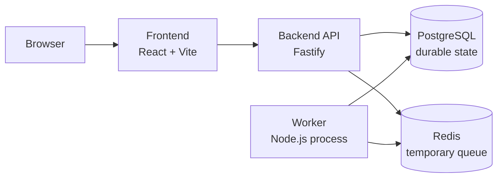

# Dockyard

Dockyard is a Docker-focused mini deployment platform and learning dashboard.

The app simulates a small deployment platform without controlling Docker Engine directly. It uses real Docker concepts around Dockerfiles, images, containers, Compose services, ports, networks, bind mounts, named volumes, build contexts, PostgreSQL persistence, Redis queue state, multi-stage builds, and logs.

## Current Status

This project is in progress. The current implementation is complete through milestone 11:

- Minimal Fastify backend with `GET /health`.
- React + Vite dashboard shell.
- Docker Compose stack with frontend, backend, worker, PostgreSQL, and Redis.
- `.env.example`, `.gitignore`, and `.dockerignore` rules.
- PostgreSQL init SQL and named volume for durable deployment data.
- Redis queue for temporary deployment jobs.
- Worker process that consumes jobs and writes heartbeat records.
- Fake deployment workflow with durable deployment logs in PostgreSQL.
- Dashboard views for deployments and platform service status.
- Development Compose override with source bind mounts and `node_modules` named volumes.
- Multi-stage backend Dockerfile with explicit `api` and `worker` targets.

Later milestones will add frontend image refinement, health checks/readiness, resource limits, runtime-like verification, debugging labs, Nginx reverse proxy, public/private networks, restart policies, a local registry, and database migrations.

## Architecture



Services:

- `frontend`: React dashboard.
- `backend`: Fastify API.
- `worker`: background deployment job processor.
- `postgres`: durable database.
- `redis`: temporary queue/cache.

## Docker Learning Goals

Dockyard is intentionally built to teach Docker from first principles:

- Dockerfile vs image vs container.
- Build-time vs run-time.
- Build context and `.dockerignore`.
- Internal container ports vs published host ports.
- Service-name networking in Docker Compose.
- Named volumes vs bind mounts.
- PostgreSQL durable state vs Redis temporary state.
- Container logs vs application/domain logs.
- Multi-stage Dockerfiles and explicit build targets.
- Why the app does not mount the Docker socket.

## Non-Goals

Dockyard deliberately does not implement:

- Real Docker Engine control from the dashboard.
- Docker socket access.
- Kubernetes, Docker Swarm, Terraform, service meshes, or cloud orchestration.
- A production-grade deployment platform.
- Production authentication or secret management.
- Real deployments from arbitrary source code.

## Project Structure

```text
.
+-- backend/
|   +-- db/init/                  PostgreSQL first-run schema
|   +-- src/                      Fastify API, queue, worker, database helpers
|   +-- test/                     Node test runner tests
|   +-- Dockerfile                Multi-stage api/worker image
|   +-- .dockerignore
|   +-- package.json
+-- frontend/
|   +-- src/                      React dashboard
|   +-- Dockerfile                Multi-stage frontend image
|   +-- .dockerignore
|   +-- package.json
+-- compose.yaml                  Runtime-like base Compose stack
+-- compose.dev.yaml              Development override with bind mounts
+-- COMMANDS.md                   Docker command notes
+-- DockerFileCMD.md              Dockerfile instruction notes
+-- PLAN.md                       Milestone implementation plan
+-- SPEC.md                       Project specification
```

`LEARNING_NOTES.md` is intentionally private and ignored by Git.

## Prerequisites

- Docker Desktop or Docker Engine with Docker Compose.
- Node.js only if you want to run backend/frontend tests directly outside Docker.

## Environment

Copy the example environment file if you want local overrides:

```powershell
Copy-Item .env.example .env
```

`.env` is ignored by Git.

The default values are for local learning only. Do not treat `dockyard_dev_password` as a real secret.

## Run With Docker Compose

Runtime-like base mode:

```powershell
docker compose up -d --build
```

Open:

```text
http://localhost:3000
```

Backend health endpoint:

```powershell
Invoke-RestMethod http://localhost:8080/health
```

Stop containers while keeping PostgreSQL data:

```powershell
docker compose down
```

Stop containers and delete Compose volumes:

```powershell
docker compose down -v
```

Be careful with `-v`: it deletes the PostgreSQL named volume and resets durable local data.

## Development Mode

Development mode uses bind mounts:

```text
./backend  -> /app
./frontend -> /app
```

That means edits on your laptop appear inside the containers immediately.

Start dev mode:

```powershell
docker compose -f compose.yaml -f compose.dev.yaml up -d --build
```

Stop dev mode:

```powershell
docker compose -f compose.yaml -f compose.dev.yaml down
```

In dev mode, PostgreSQL is published to the host for local database tools. Redis remains private.

## Build Backend Images Directly

The backend and worker share one Dockerfile. They are separate final targets:

```powershell
docker build --target api -t dockyard-api:dev ./backend
docker build --target worker -t dockyard-worker:dev ./backend
```

Simple meaning:

```text
Use the same backend Dockerfile,
but stop at a different final stage.
```

Inspect the API image layers:

```powershell
docker history dockyard-api:dev
```

## Useful Docker Commands

```powershell
docker compose config
docker compose ps
docker compose logs --tail=20 backend
docker compose logs --tail=20 worker
docker volume ls
docker images --filter reference=dockyard-*
```

More notes live in `COMMANDS.md` and `DockerFileCMD.md`.

## Tests

Backend tests:

```powershell
cd backend
npm test
```

Frontend build check:

```powershell
cd frontend
npm run build
```

## Persistence Model

PostgreSQL stores durable data in a Docker named volume:

```text
dockyard_postgres-data
```

Deployment records, deployment logs, and worker heartbeat rows are stored there.

Redis is temporary queue/cache state. It is not persisted in this project yet. If Redis loses queued jobs, PostgreSQL remains the durable source of truth.

## Logging Model

Dockyard uses two kinds of logs:

- Container logs: stdout/stderr from services, viewed with `docker compose logs`.
- Application/domain logs: deployment timeline records stored in PostgreSQL by deployment id.

This distinction is intentional. Docker logs help debug processes. Deployment logs explain what happened to one simulated deployment.

## Safety Notes

- The dashboard does not inspect or control Docker Engine.
- The Docker socket is not mounted into any container.
- `.env` is ignored by Git.
- `.dockerignore` files keep local config, dependencies, logs, and build output out of Docker build contexts.
- Runtime backend containers run as the non-root `node` user.
- Redis has no published host port.
- Worker exposes no port.

## Roadmap

Next milestones from `PLAN.md`:

- Milestone 12: multi-stage frontend Dockerfile refinement.
- Milestone 13: health checks and readiness.
- Milestone 14: resource limits.
- Milestone 15: runtime-like Compose mode verification.
- Milestone 16: debugging exercises pack.
- Milestone 17: Nginx reverse proxy.
- Milestone 18: public/private network split.
- Milestone 19: restart policies.
- Milestone 20: local registry.
- Milestone 21: database migrations.
- Milestone 22: debugging lab.
