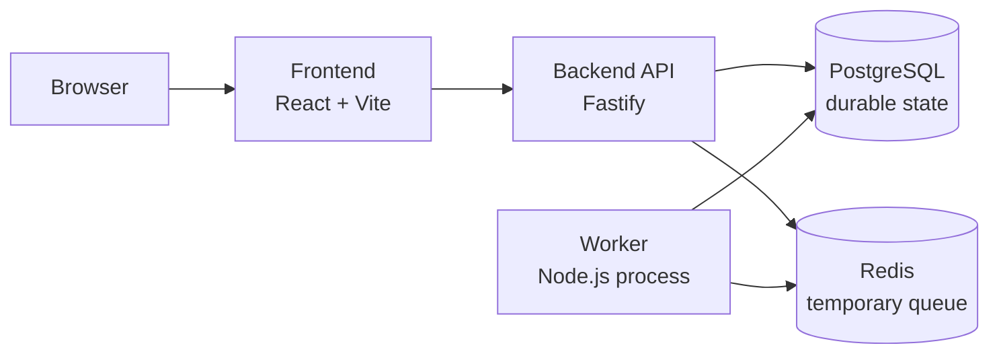

# Dockyard

Dockyard is a Docker-focused mini deployment platform and learning dashboard.

The app simulates a small deployment platform without controlling Docker Engine directly. It uses real Docker concepts around Dockerfiles, images, containers, Compose services, ports, networks, bind mounts, named volumes, build contexts, PostgreSQL persistence, Redis queue state, multi-stage builds, and logs.

## Current Status

This project is in progress. The current implementation is complete through milestone 21:

- Minimal Fastify backend with `GET /health`.
- React + Vite dashboard shell.
- Docker Compose stack with frontend, backend, worker, PostgreSQL, and Redis.
- `.env.example`, `.gitignore`, and `.dockerignore` rules.
- PostgreSQL init SQL and named volume for durable deployment data.
- Redis queue for temporary deployment jobs.
- Worker process that consumes jobs and writes heartbeat records.
- Fake deployment workflow with durable deployment logs in PostgreSQL.
- Dashboard views for deployments and platform service status.
- Development Compose override with source bind mounts and `node_modules` named volumes.
- Multi-stage backend Dockerfile with explicit `api` and `worker` targets.
- Multi-stage frontend Dockerfile with a Node builder stage and non-root Nginx static runtime.
- Health checks for PostgreSQL, Redis, and backend readiness.
- Health-based Compose dependency ordering plus backend/worker app-level retry.
- CPU and memory limits for every Compose service.
- Opt-in worker CPU stress mode for observing resource limits.
- Runtime-like base Compose mode runs app containers from built image contents.
- Milestone 16 debugging exercises for port mappings, service-name database URLs, temporary Redis queue loss, worker heartbeat staleness, and PostgreSQL container versus volume deletion.
- Nginx reverse proxy mode routes `/` to the frontend and `/api` to the backend while removing direct backend host publishing.
- Frontend and Nginx health checks are available for proxy-mode startup ordering.
- Proxy mode splits Docker networking into public and private networks so Nginx/frontend cannot directly reach PostgreSQL or Redis.
- Bounded restart policies retry crashed service processes without hiding repeated failures forever.
- Local Docker registry override for practicing image tags, push, pull, and image inspection.
- Database migrations upgrade existing PostgreSQL volumes without deleting durable data.

Later milestones will add a combined debugging lab.

## Architecture



Services:

- `frontend`: React dashboard.
- `backend`: Fastify API.
- `worker`: background deployment job processor.
- `postgres`: durable database.
- `redis`: temporary queue/cache.

## Docker Learning Goals

Dockyard is intentionally built to teach Docker from first principles:

- Dockerfile vs image vs container.
- Build-time vs run-time.
- Build context and `.dockerignore`.
- Internal container ports vs published host ports.
- Service-name networking in Docker Compose.
- Named volumes vs bind mounts.
- PostgreSQL durable state vs Redis temporary state.
- Container logs vs application/domain logs.
- Multi-stage Dockerfiles and explicit build targets.
- Why the app does not mount the Docker socket.

## Non-Goals

Dockyard deliberately does not implement:

- Real Docker Engine control from the dashboard.
- Docker socket access.
- Kubernetes, Docker Swarm, Terraform, service meshes, or cloud orchestration.
- A production-grade deployment platform.
- Production authentication or secret management.
- Real deployments from arbitrary source code.

## Project Structure

```text
.
+-- backend/
|   +-- db/init/                  PostgreSQL first-run schema
|   +-- db/migrations/            PostgreSQL upgrades for existing volumes
|   +-- src/                      Fastify API, queue, worker, database helpers
|   +-- test/                     Node test runner tests
|   +-- Dockerfile                Multi-stage api/worker image
|   +-- .dockerignore
|   +-- package.json
+-- frontend/
|   +-- src/                      React dashboard
|   +-- Dockerfile                Multi-stage frontend image
|   +-- .dockerignore
|   +-- package.json
+-- nginx/
|   +-- reverse-proxy.conf        Milestone 17 Nginx gateway rules
+-- compose.yaml                  Runtime-like base Compose stack
+-- compose.dev.yaml              Development override with bind mounts
+-- compose.proxy.yaml            Nginx reverse proxy override
+-- compose.registry.yaml         Local registry override for image push/pull practice
+-- MILESTONE_16_DEBUGGING.md     Controlled Docker debugging exercises
+-- COMMANDS.md                   Docker command notes
+-- DockerFileCMD.md              Dockerfile instruction notes
+-- PLAN.md                       Milestone implementation plan
+-- SPEC.md                       Project specification
```

`LEARNING_NOTES.md` is intentionally private and ignored by Git.

## Prerequisites

- Docker Desktop or Docker Engine with Docker Compose.
- Node.js only if you want to run backend/frontend tests directly outside Docker.

## Environment

Copy the example environment file if you want local overrides:

```powershell
Copy-Item .env.example .env
```

`.env` is ignored by Git.

The default values are for local learning only. Do not treat `dockyard_dev_password` as a real secret.

## Run With Docker Compose

Runtime-like base mode:

```powershell
docker compose up -d --build
```

Open:

```text
http://localhost:3000
```

Backend health endpoint:

```powershell
Invoke-RestMethod http://localhost:8080/health
```

Stop containers while keeping PostgreSQL data:

```powershell
docker compose down
```

Stop containers and delete Compose volumes:

```powershell
docker compose down -v
```

Be careful with `-v`: it deletes the PostgreSQL named volume and resets durable local data.

## Runtime-Like Mode

Milestone 15 verifies that base `compose.yaml` runs from built image contents.

Simple meaning:

```text
Docker builds the images first.
Containers run the files already inside those images.
Your laptop source folders are not mounted into /app.
```

This is different from development mode, where `compose.dev.yaml` bind-mounts source code for fast editing.

Runtime-like mode intentionally keeps:

```text
frontend published to localhost:3000
backend published to localhost:8080
PostgreSQL private to the Docker network
Redis private to the Docker network
worker with no published port
```

Base runtime-like mode still publishes the backend for direct API learning.
Proxy mode removes that direct backend host port and sends API traffic through Nginx instead.

## Nginx Reverse Proxy Mode

Milestones 17 and 18 add an optional proxy override:

```powershell
docker compose -f compose.yaml -f compose.proxy.yaml up -d --build
```

Open:

```text
http://localhost:3000
```

In this mode, `localhost:3000` reaches the `nginx` container first.

Simple meaning:

```text
Browser -> Nginx -> frontend for /
Browser -> Nginx -> backend for /api
```

A reverse proxy is a front door. The browser talks to Nginx, and Nginx talks to the other containers by their Compose service names.

Proxy mode intentionally changes published ports:

```text
nginx published to localhost:3000 and attached to the public network
frontend not published directly and attached to the public network
backend not published directly and attached to public + private networks
PostgreSQL attached to the private network only
Redis attached to the private network only
worker attached to the private network only, with no published port
```

Milestone 18 network split:

```text
public network  -> nginx, frontend, backend
private network -> backend, postgres, redis, worker
```

Simple meaning:

```text
Nginx can find frontend and backend by service name.
Nginx cannot directly find postgres or redis by service name.
Backend can find both sides because it is attached to both networks.
```

That means this direct backend URL should not be used in proxy mode:

```text
http://localhost:8080
```

Use the proxy path instead:

```powershell
Invoke-RestMethod http://localhost:3000/api/health
```

Check proxy-mode containers:

```powershell
docker compose -f compose.yaml -f compose.proxy.yaml ps
```

Inspect the split networks:

```powershell
docker network inspect dockyard_public
docker network inspect dockyard_private
```

## Debugging Exercises

Milestone 16 adds a guided debugging pack:

```text
MILESTONE_16_DEBUGGING.md
```

It practices five controlled and reversible Docker failures:

- wrong backend port mapping
- wrong `DATABASE_URL` hostname
- Redis restart/recreate losing queued jobs
- stale worker heartbeat
- PostgreSQL container deletion versus volume deletion

Read the warnings carefully before any command that deletes volumes. Deleting a container is usually recoverable. Deleting the PostgreSQL volume intentionally resets durable local data.

## Development Mode

Development mode uses bind mounts:

```text
./backend  -> /app
./frontend -> /app
```

That means edits on your laptop appear inside the containers immediately.

Start dev mode:

```powershell
docker compose -f compose.yaml -f compose.dev.yaml up -d --build
```

Stop dev mode:

```powershell
docker compose -f compose.yaml -f compose.dev.yaml down
```

In dev mode, PostgreSQL is published to the host for local database tools. Redis remains private.

## Build Backend Images Directly

The backend and worker share one Dockerfile. They are separate final targets:

```powershell
docker build --target api -t dockyard-api:dev ./backend
docker build --target worker -t dockyard-worker:dev ./backend
```

Simple meaning:

```text
Use the same backend Dockerfile,
but stop at a different final stage.
```

Inspect the API image layers:

```powershell
docker history dockyard-api:dev
```

## Useful Docker Commands

```powershell
docker compose config
docker compose ps
docker compose logs --tail=20 backend
docker compose logs --tail=20 worker
docker inspect dockyard-backend-1
docker stats
docker volume ls
docker images --filter reference=dockyard-*
```

More notes live in `COMMANDS.md` and `DockerFileCMD.md`.

## Tests

Backend tests:

```powershell
cd backend
npm test
```

Frontend build check:

```powershell
cd frontend
npm run build
```

## Build Frontend Image Directly

The frontend Dockerfile has two stages:

```text
builder -> uses Node.js to compile the Vite app
runtime -> uses Nginx to serve only the compiled static files
```

Build the runtime image:

```powershell
docker build -t dockyard-frontend:dev ./frontend
```

Inspect the frontend image layers:

```powershell
docker history dockyard-frontend:dev
```

In simple terms:

```text
Node, npm, Vite, and source files are useful while building.
The running frontend container only needs Nginx and the files from dist/.
```

## Local Registry

Milestone 20 adds an opt-in local Docker registry:

```powershell
docker compose -f compose.registry.yaml up -d
```

It publishes:

```text
localhost:5000 -> registry container port 5000
```

Simple meaning:

```text
Your laptop Docker CLI can push images to localhost:5000.
Your laptop Docker CLI can pull images back from localhost:5000.
```

The registry service uses:

```yaml
image: registry:2
```

That means:

```text
registry = Docker image name
2        = image tag/version
```

The registry stores built Docker images. Git stores source code.

Registry versus Git repo:

```text
Git repo  -> source files, Dockerfiles, Compose files, history of code changes
Registry  -> built image artifacts that Docker can pull and run
```

Example flow:

```text
source code in Git
-> docker build
-> dockyard-api:dev image exists locally
-> docker tag
-> docker push localhost:5000/dockyard-api:milestone-20
-> docker pull localhost:5000/dockyard-api:milestone-20
```

For this milestone, run these commands yourself so you can see the output:

```powershell
docker tag dockyard-api:dev localhost:5000/dockyard-api:milestone-20
docker push localhost:5000/dockyard-api:milestone-20
docker pull localhost:5000/dockyard-api:milestone-20
docker images
```

The tag matters:

```text
localhost:5000/dockyard-api:milestone-20
```

Simple meaning:

```text
localhost:5000       -> which registry
dockyard-api         -> which image name
milestone-20         -> which version/label of the image
```

If you use the wrong tag, Docker may push or pull a different artifact than the one you intended. That is the core lesson of this milestone.

## Persistence Model

PostgreSQL stores durable data in a Docker named volume:

```text
dockyard_postgres-data
```

Deployment records, deployment logs, and worker heartbeat rows are stored there.

Redis is temporary queue/cache state. It is not persisted in this project yet. If Redis loses queued jobs, PostgreSQL remains the durable source of truth.

## Database Migrations

Milestone 21 adds database migrations for schema changes after data already exists.

Simple meaning:

```text
init SQL creates tables only when the PostgreSQL volume is fresh.
migrations upgrade tables that already exist inside dockyard_postgres-data.
```

Run migrations from the backend container:

```powershell
docker compose exec backend npm run migrate
```

The migration runner records completed files in:

```text
schema_migrations
```

That tracking table makes migrations idempotent, which means they are safe to run again. On the second run, already-applied migration files are skipped instead of changing the same schema twice.

Do not use `docker compose down -v` for schema upgrades. That command deletes the PostgreSQL named volume, so it resets durable local database data instead of upgrading it.

Milestone 21 adds this explicit schema change:

```text
deployments.environment
```

Existing deployment rows keep their old values and receive:

```text
environment = local
```

## Logging Model

Dockyard uses two kinds of logs:

- Container logs: stdout/stderr from services, viewed with `docker compose logs`.
- Application/domain logs: deployment timeline records stored in PostgreSQL by deployment id.

This distinction is intentional. Docker logs help debug processes. Deployment logs explain what happened to one simulated deployment.

## Health And Readiness

Milestone 13 adds health checks.

Simple meaning:

```text
started = Docker launched the container process
healthy = the service passed a check that proves it is usable
unhealthy = the process exists, but the check failed
exited = the process stopped
```

PostgreSQL is healthy when it accepts a database readiness check.
Redis is healthy when it answers `PING`.
The backend is healthy only when `/health` can reach both PostgreSQL and Redis.

Compose uses those checks for startup ordering:

```text
PostgreSQL healthy + Redis healthy -> backend starts
backend healthy + infrastructure healthy -> worker/frontend start
```

The backend and worker also retry dependency checks in application code. Compose helps at startup, but app-level retry matters because Redis or PostgreSQL can restart later.

## Restart Policies

Milestone 19 adds bounded restart policies:

```yaml
restart: "on-failure:3"
```

Simple meaning:

```text
If the container's main process exits with an error, Docker may restart it.
Docker tries only a few times, so repeated crashes are still visible.
```

In Dockyard, each service has the same bounded policy in base Compose mode:

```text
frontend -> on-failure:3
backend  -> on-failure:3
worker   -> on-failure:3
postgres -> on-failure:3
redis    -> on-failure:3
```

A restart policy reacts to a process exit, not every kind of broken service.

Simple difference:

```text
exited    = the main process stopped
unhealthy = the process still runs, but the health check is failing
```

Example:

```text
backend Node process crashes
-> container exits
-> restart policy can restart it

backend Node process keeps running, but Redis is unreachable
-> backend health check can become unhealthy
-> restart policy does not necessarily restart it
```

That is why Dockyard keeps health checks, application retry, worker heartbeat, and logs. Restart policies are recovery behavior. Health and logs are observability behavior.

A crash loop means the same container keeps starting, crashing, and restarting:

```text
worker starts
worker crashes
Docker restarts worker
worker crashes again
```

Logs still reveal this pattern:

```powershell
docker compose logs --tail=50 worker
docker inspect dockyard-worker-1
```

Look for repeated startup/error lines in the logs, and inspect:

```text
RestartCount
State.Status
State.StartedAt
State.FinishedAt
```

If `RestartCount` is greater than zero, Docker has restarted that container. If the logs show the same startup and failure message again and again, that is a crash loop.

## Resource Limits

Milestone 14 adds CPU and memory limits to every service.

Simple meaning:

```text
cpus = how much CPU time a container may use
mem_limit = how much memory a container may use
```

The current limits are intentionally small because Dockyard is a local learning app:

```text
frontend  -> 0.25 CPU, 128m memory
backend   -> 0.50 CPU, 256m memory
worker    -> 0.50 CPU, 256m memory
postgres  -> 0.75 CPU, 512m memory
redis     -> 0.25 CPU, 128m memory
```

PostgreSQL gets the largest memory limit because it stores durable data.
Redis gets an explicit small memory limit because queue/cache memory should be bounded.

The worker has an optional CPU stress mode for learning:

```text
WORKER_STRESS_MODE=off  -> normal worker
WORKER_STRESS_MODE=cpu  -> short CPU bursts so docker stats visibly changes
```

Keep stress mode off unless you are deliberately observing resource usage.

## Safety Notes

- The dashboard does not inspect or control Docker Engine.
- The Docker socket is not mounted into any container.
- `.env` is ignored by Git.
- `.dockerignore` files keep local config, dependencies, logs, and build output out of Docker build contexts.
- Runtime backend containers run as the non-root `node` user.
- Runtime frontend containers run as the non-root `nginx` user.
- Backend health does not report healthy unless PostgreSQL and Redis checks pass.
- Frontend and Nginx have health checks for proxy mode.
- Every Compose service has explicit CPU and memory limits.
- Every base Compose service has a bounded `on-failure:3` restart policy.
- Proxy-mode Nginx also has a bounded `on-failure:3` restart policy.
- The local registry stores pushed image blobs in a named volume.
- Database schema changes use `npm run migrate` instead of deleting `dockyard_postgres-data`.
- Runtime-like mode does not mount frontend/backend source folders into app containers.
- In proxy mode, only Nginx is published to the host.
- In proxy mode, Nginx and frontend are not attached to the private PostgreSQL/Redis network.
- Redis has no published host port.
- Worker exposes no port.
- Restart policies do not replace health checks, logs, or worker heartbeat status.

## Roadmap

Next milestones from `PLAN.md`:

- Milestone 22: debugging lab.
