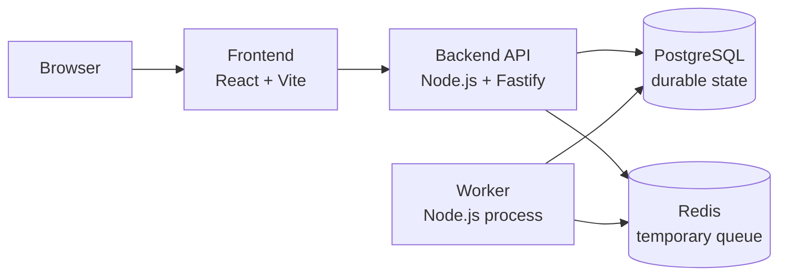

# Dockyard

## 1. Project Title

Dockyard is a Docker-focused mini deployment platform and container management learning dashboard.

## 2. Project Purpose

The purpose of Dockyard is to learn Docker deeply by building a local multi-container application that behaves like a small deployment platform. The project should be useful and motivating, but Docker learning is the primary success criterion.

Dockyard starts as a safe, simulated deployment platform. It does not control the Docker Engine directly. Instead, it uses real Docker concepts around services, images, containers, ports, networks, volumes, health checks, logs, resource limits, and Compose.

## 3. Learning Objectives

- Understand the difference between Dockerfiles, images, containers, networks, volumes, bind mounts, and build contexts.
- Learn Docker Compose through a real multi-service local system.
- Practice Docker networking through service names, internal ports, published ports, and later public/private networks.
- Learn persistence through PostgreSQL named volumes and disposable Redis state.
- Understand development containers versus runtime-like containers.
- Learn multi-stage Dockerfiles from the beginning.
- Practice health checks, readiness, app-level retry, and worker heartbeat behavior.
- Observe logs at two levels: container logs and application/domain logs.
- Use explicit CPU and memory limits for all services.
- Practice deliberate Docker debugging scenarios.
- Learn high-level Docker Engine/socket, Docker secrets, and remote registry concepts without implementing risky controls early.

## 4. Non-Goals

- No Kubernetes, Docker Swarm, service mesh, Terraform, or cloud orchestration.
- No production-grade deployment platform.
- No multi-user authentication system in early milestones.
- No Docker Engine socket access or direct container control from the web app.
- No remote registry implementation with Docker Hub or GitHub Container Registry.
- No complex frontend beyond what supports Docker learning.

## 5. High-Level User Experience

The user opens a local dashboard and sees two tabs:

- Deployments
- Platform Services

In the Deployments tab, the user can trigger a fake Docker-themed deployment. The deployment moves through statuses and writes timeline logs.

In the Platform Services tab, the user sees honest, limited service status based on app-level checks, not fake Docker Engine inspection. The dashboard also shows Docker command hints to help the user inspect the real Compose environment manually.

## 6. Functional Requirements

- The user can create a fake deployment.
- The backend stores deployment records in PostgreSQL.
- The backend queues deployment jobs in Redis.
- The worker consumes Redis jobs and updates deployment state in PostgreSQL.
- The worker writes deployment/domain logs to PostgreSQL.
- Services write useful process logs to stdout/stderr for Docker logs.
- The frontend displays deployment status and deployment logs.
- The frontend displays limited platform service status.
- The backend exposes a health endpoint.
- The backend health endpoint checks PostgreSQL and Redis reachability.
- The worker writes periodic heartbeat information to PostgreSQL.
- The dashboard provides Docker command hints for manual inspection.

## 7. Service / Component Architecture



Initial services:

- `frontend`: React + Vite dashboard.
- `backend`: Node.js + Fastify API.
- `worker`: Node.js background job processor.
- `postgres`: durable database.
- `redis`: temporary job queue/cache.

## 8. Docker Architecture

Dockyard uses Docker Compose for local orchestration.

The backend and worker are built from one backend Dockerfile with shared setup and separate final targets:

- `api` target
- `worker` target

The frontend uses a multi-stage Dockerfile:

- builder stage: install dependencies and build the Vite app
- runtime stage: serve static files with `nginx:alpine`

Base image strategy:

- backend/worker: Debian slim style Node image for easier debugging
- frontend runtime: `nginx:alpine`

All Docker build contexts must have strict `.dockerignore` rules.

## 9. Networking Model

Initial networking:

```text
one Compose network:
frontend
backend
postgres
redis
worker
```

Initial published ports:

- frontend published to host
- backend published to host for API testing
- PostgreSQL published only in development override
- Redis remains private
- worker has no listening port

Later reverse proxy milestone:

```text
public network:
frontend
backend
nginx

private network:
backend
postgres
redis
worker
```

At that milestone:

- Nginx becomes the public gateway.
- Backend host publishing is removed.
- Frontend and Nginx get health checks.

## 10. Storage / Persistence Model

PostgreSQL uses a named Docker volume for durable data.

Redis is not persisted. Redis stores temporary queue state. If Redis loses queued jobs, PostgreSQL remains the durable source of truth. Pending deployments can be re-enqueued from PostgreSQL.

Development source code uses bind mounts:

```text
./backend -> /app
./frontend -> /app
```

Development `node_modules` uses named Docker volumes:

```text
backend-node-modules -> /app/node_modules
frontend-node-modules -> /app/node_modules
```

Runtime-like mode does not use source bind mounts.

Early generated worker scratch files are disposable. Deployment history and domain logs are stored in PostgreSQL. No extra artifact volume is included in early milestones.

## 11. Development Workflow

Dev mode uses:

- source bind mounts
- dev server / hot reload where appropriate
- PostgreSQL host publishing for local database tools
- named volumes for `node_modules`

Runtime-like mode uses:

- built images only
- no source bind mounts
- PostgreSQL private to the Docker network
- frontend served by Nginx

Planned Compose structure:

- `compose.yaml`: shared base
- `compose.dev.yaml`: development bind mounts, dev commands, dev-only port publishing
- `compose.proxy.yaml`: later Nginx reverse proxy milestone
- `compose.registry.yaml`: later local registry milestone

## 12. Image-Building Strategy

All application Dockerfiles use multi-stage builds from the beginning.

Backend/worker:

- shared dependency/setup stage
- `api` target
- `worker` target

Frontend:

- Node builder stage
- Nginx runtime stage

Image tags:

- early: simple local dev tags such as `dockyard-api:dev`
- later: deployment-specific tags such as `sample-app:deploy-42`

Registry strategy:

- no registry at first
- later add a local registry container as a learning milestone
- discuss Docker Hub/GHCR at a high level only

## 13. Docker Compose Structure

Compose must define:

- services
- one initial default network
- PostgreSQL named volume
- dev `node_modules` named volumes
- health checks for PostgreSQL, Redis, and backend
- resource limits for all services
- no restart policies in early milestones

Readiness strategy:

- Compose dependency ordering waits for PostgreSQL and Redis health.
- Backend and worker also use app-level retry.

## 14. Observability / Logging Requirements

Two kinds of logs are required:

Container logs:

- written to stdout/stderr
- viewed with `docker logs` and `docker compose logs`
- used for debugging service behavior

Application/domain logs:

- written to PostgreSQL
- associated with a deployment id
- shown in the deployment detail view

Worker status:

- worker writes periodic heartbeat records to PostgreSQL
- backend reports whether the worker heartbeat is fresh or stale

## 15. Failure / Debugging Scenarios

Each major milestone should include a small debugging exercise. A later debugging lab should combine multiple failures.

Required scenarios include:

- wrong backend database hostname, such as `localhost` instead of `postgres`
- wrong port mapping
- PostgreSQL volume reset versus container restart
- Redis restart losing queued jobs
- unhealthy backend due to dependency failure
- startup/readiness race
- backend container crash
- worker heartbeat becoming stale
- memory/CPU limit observation
- build cache behavior after changing dependency files versus source files
- `.dockerignore` mistake that sends unnecessary or sensitive files
- later Nginx routing failure

## 16. Security Concepts Included For Learning

Included:

- `.env` plus `.env.example`
- `.env` ignored by git
- strict `.dockerignore`
- do not bake secrets into images
- run runtime containers as non-root users where practical
- discuss build-time ARG versus runtime ENV
- discuss image layer leakage with fake secrets

Postponed or high-level only:

- Docker secrets
- Docker socket access
- remote registry credentials
- production secret management

## 17. Progressive Implementation Milestones

### Milestone 1: Compose Skeleton And Basic Services

What to build:

- Compose project with frontend, backend, worker, PostgreSQL, and Redis.
- Basic backend health endpoint.
- Basic frontend shell.

Docker concepts learned:

- services
- containers
- Compose project
- internal service names
- published ports

Commands to understand:

```bash
docker compose up
docker compose down
docker compose ps
docker ps
docker logs
docker compose logs
```

Explain afterward:

- Which services are running as containers?
- Which ports are published to the host?
- Why does the worker not publish a port?

Debugging exercise:

- Break a port mapping and diagnose why the browser or API cannot connect.

### Milestone 2: PostgreSQL Persistence And Init SQL

What to build:

- PostgreSQL named volume.
- Mounted init SQL scripts.
- Tables for deployments, deployment logs, and worker heartbeat.

Docker concepts learned:

- named volumes
- container deletion versus volume deletion
- first-run database initialization

Commands to understand:

```bash
docker volume ls
docker volume inspect
docker compose down -v
docker compose exec postgres psql
```

Explain afterward:

- Where exactly is PostgreSQL data stored?
- Why does init SQL run only after a fresh volume is created?
- What happens after `docker compose down` versus `docker compose down -v`?

Debugging exercise:

- Remove only the container and observe data remains. Then remove the volume and observe the database resets.

### Milestone 3: Redis Queue And Worker

What to build:

- Backend queues fake deployment jobs in Redis.
- Worker consumes jobs.
- Worker writes status/logs to PostgreSQL.
- Worker writes heartbeat records.

Docker concepts learned:

- internal service-to-service networking
- Redis as temporary state
- non-web worker container

Commands to understand:

```bash
docker compose logs worker
docker compose exec redis redis-cli
docker inspect
```

Explain afterward:

- Why can the worker reach Redis?
- Why is Redis not published to the host?
- What happens to queued jobs when Redis is recreated?

Debugging exercise:

- Restart Redis and recover pending jobs from PostgreSQL.

### Milestone 4: Multi-Stage Images And Runtime Mode

What to build:

- Backend multi-stage Dockerfile with `api` and `worker` targets.
- Frontend multi-stage Dockerfile with Nginx runtime.
- Runtime-like Compose mode with no source bind mounts.

Docker concepts learned:

- build stages
- final targets
- image layers
- build cache
- runtime image contents

Commands to understand:

```bash
docker build
docker images
docker history
docker compose build
```

Explain afterward:

- What happens at build-time?
- What happens at run-time?
- Why can one Dockerfile produce API and worker images?
- Why is the frontend runtime image different from the frontend builder stage?

Debugging exercise:

- Change source code and dependency metadata separately; observe build cache behavior.

### Milestone 5: Health Checks, Readiness, And Resource Limits

What to build:

- PostgreSQL health check.
- Redis health check.
- Backend health check that checks PostgreSQL and Redis.
- Compose health-based dependency ordering.
- App-level retry in backend and worker.
- CPU/RAM limits for all services.

Docker concepts learned:

- started versus healthy
- dependency readiness
- app resilience
- resource constraints

Commands to understand:

```bash
docker inspect
docker stats
docker compose ps
```

Explain afterward:

- What is the difference between crashed and unhealthy?
- Why can PostgreSQL be running but not ready?
- Why should the app still retry if Compose waits for health?

Debugging exercise:

- Break `DATABASE_URL` and observe backend unhealthy while PostgreSQL is healthy.

### Milestone 6: Dashboard Logs And Command Hints

What to build:

- Deployments tab.
- Platform Services tab.
- Deployment timeline logs from PostgreSQL.
- Docker command hints for manual inspection.

Docker concepts learned:

- container logs versus application/domain logs
- honest status without Docker Engine access

Commands to understand:

```bash
docker compose logs backend
docker compose logs worker
docker compose exec backend sh
docker compose exec worker sh
```

Explain afterward:

- Why are deployment logs not the same as Docker logs?
- What status can the app know without Docker Engine access?

Debugging exercise:

- Make the worker fail one job and compare worker container logs with deployment logs.

### Milestone 7: Nginx Reverse Proxy And Network Split

What to build:

- Nginx reverse proxy.
- Public/private Docker networks.
- Remove backend host port publishing.
- Add frontend and Nginx health checks.

Docker concepts learned:

- reverse proxy
- gateway service
- public versus private services
- multi-network service attachment

Commands to understand:

```bash
docker network ls
docker network inspect
docker compose ps
```

Explain afterward:

- Why can Nginx reach the frontend and backend?
- Why can the frontend not reach PostgreSQL after the network split?
- Why is the backend no longer published to the host?

Debugging exercise:

- Misroute `/api` in Nginx and diagnose the failure.

### Milestone 8: Restart Policies

What to build:

- Add restart policies after crash behavior is understood.
- Compare manual restart with automatic restart.

Docker concepts learned:

- exited containers
- restart policy behavior
- manual versus automatic recovery

Commands to understand:

```bash
docker compose restart
docker compose stop
docker inspect
```

Explain afterward:

- What does Docker restart automatically?
- Why does a restart policy react to crashes but not necessarily unhealthy status?

Debugging exercise:

- Crash the worker and observe behavior before and after restart policy is added.

### Milestone 9: Local Registry

What to build:

- Add local registry container.
- Tag and push a local image to the local registry.
- Pull/run the image locally.

Docker concepts learned:

- registry
- image push/pull
- tags
- local versus remote image distribution

Commands to understand:

```bash
docker tag
docker push
docker pull
docker images
```

Explain afterward:

- What does a registry store?
- How is a registry different from a Git repository?
- Why might a server pull an image instead of building from source?

Debugging exercise:

- Use the wrong image tag and diagnose why pull/run fails.

### Milestone 10: Database Migrations

What to build:

- Introduce migrations when editing init SQL becomes limiting.
- Add at least one schema change without deleting the database volume.

Docker concepts learned:

- persistent database evolution
- image/app changes versus volume data changes

Commands to understand:

```bash
docker compose exec backend npm run migrate
docker compose logs backend
```

Explain afterward:

- Why does editing init SQL not update an existing volume?
- Why are migrations useful after data already exists?

Debugging exercise:

- Run new backend code against old schema, observe failure, then fix with migration.

## 18. Learning Checkpoints

By the end of the project, the learner should be able to answer:

- What is the difference between a Dockerfile, image, and container?
- What happens at build-time versus run-time?
- What is a build context?
- Why does `.dockerignore` matter?
- Why can one service reach another by service name?
- Why does `localhost` mean different things inside and outside a container?
- What is the difference between an internal container port and a published host port?
- Where exactly is PostgreSQL data persisted?
- What happens when a container is deleted?
- What happens when a volume is deleted?
- Why is Redis allowed to lose state in this project?
- Why does the worker not expose a port?
- What is the difference between container logs and deployment logs?
- What is the difference between crashed and unhealthy?
- Why is Docker socket access powerful and risky?
- Why are secrets passed at run-time instead of copied into images?
- Why is Nginx useful as a reverse proxy?
- Why are public/private networks useful?
- What does a registry store?

## 19. Definition Of Done

The project is done when:

- All milestones through the local registry milestone are implemented.
- The app runs locally with Docker Compose.
- Dev mode and runtime-like mode both work.
- PostgreSQL data persists through container replacement.
- Redis loss can be explained and recovered through PostgreSQL state.
- The dashboard supports fake deployments and shows deployment logs.
- Platform status is honest and does not fake Docker Engine access.
- Health checks and worker heartbeat are visible.
- Resource limits are configured for all services.
- Nginx reverse proxy milestone removes direct backend host publishing.
- Each milestone has a documented debugging exercise.
- The learner can answer the learning checkpoint questions.

## 20. Features Deliberately Postponed Or Excluded

Excluded from implementation:

- Docker Engine socket access from the backend.
- Real container start/stop/restart from the dashboard.
- Kubernetes/Swarm/cloud orchestration.
- Production authentication and authorization.
- Remote Docker Hub/GHCR push/pull implementation.

Postponed:

- Docker secrets.
- Real deployment from arbitrary source code.
- Advanced worker health checks.
- Centralized logging stack.
- Artifact storage volume.
- Multi-user permissions.
